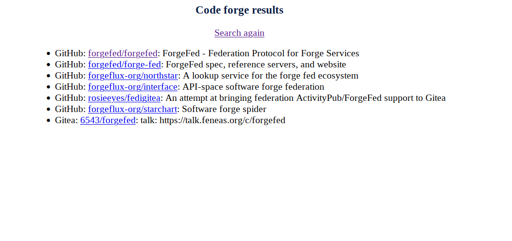

# ForgeFind

This is a simple, hacked-together python webapp to serve as a proof-of-concept dempnstration of a search tool similar to https://grep.app that can search multiple different code hosting platforms.

## Setup and running
1. `pipenv install`
2. (optional) create a .env file according to the env variables below
3. `FLASK_APP=app pipenv run flask run`

### Environment variables
`GITLAB_TOKEN` - [a token appropriate for accessing the gitlab.com api](https://docs.gitlab.com/ee/api/#authentication).

## Forge support:
Currently the following forges are included in results:
- Github
- GitLab
- Gitea

